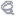

# Suntower <!-- omit in toc -->

Suntower is a Foddian rage platformer built in Godot. You help a sunflower reach the top of the tower, navigating difficult weather conditions along the way. The core mechanic is hook-based climbing with a rope that can extend and retract.

## [Play Suntower on itch.io](https://henree.itch.io/suntower) <!-- omit in toc -->

---

## Table of Contents <!-- omit in toc -->

- [Core Mechanics](#core-mechanics)
  - [Flower Movement - `Head.gd`](#flower-movement---headgd)
    - [Head, Pot, and Vine](#head-pot-and-vine)
    - [State Machine](#state-machine)
      - [Inactive](#inactive)
      - [Extending](#extending)
      - [Retracting](#retracting)
    - [Rope Physics](#rope-physics)
      - [Extension](#extension)
      - [Retraction](#retraction)
  - [Weather - `Tower.gd`](#weather---towergd)
    - [Light Raycasting](#light-raycasting)
    - [Sunny ](#sunny-)
    - [Stormy ](#stormy-)
    - [Windy ](#windy-)
    - [Calm ](#calm-)
- [Acknowledgments and Credits](#acknowledgments-and-credits)

---

## Core Mechanics

### Flower Movement - [`Head.gd`](./scenes/character/Head.gd)

#### Head, Pot, and Vine

The **Head** is the head of the flower. It has low mass, no gravity, and looks towards the mouse. It's the point from which the flower extends and retracts during gameplay. It has a circular hitbox by default, and grows two spikes used to hook onto objects while climbing.

The **Pot** is the base of the flower. It has high mass, high gravity, and high friction with the floor. It roots the flower to the ground, and can be swung to the left and right while retracting. Since the Pot is the heaviest, it is the only part of the flower that needs to be safely placed onto a platform for the flower to not fall off. It has a square hitbox.

The **Vine(s)** are the segments that make up the flower's stem. They are small, light, low-gravity physics bodies that are pinned together with pin joints. They're used to pull the Pot to the Head when the Head extends and latches onto a faraway object.

#### State Machine

The player's physical state is stored in an enum:

```gdscript
enum State {INACTIVE, EXTENDING, RETRACTING}
```

##### Inactive

While **inactive**, the player can aim the Head with the mouse. The Pot also has normal gravity.
The player can begin **extending** if the Pot is stable:

```gdscript
# Player can extend if the pot is stable
can_extend = _pot.touching and _pot.linear_velocity.length_squared() < 2.0
```

##### Extending

While **extending**, the Head grows spikes, turns steadily towards the mouse, and flies in its forward direction. The Pot has no gravity and very high linear drag, causing it to float mostly in place. Vines have no gravity while extending.

This combination of physical properties allows the player to extend from their current position to a further one. Then, the player will use the Head's hooks to find a secure hold, and begin **retracting**. Running out of extension length will also transition to **retracting**.

##### Retracting

While **retracting**, the Pot regains gravity, immediately weighing the entire flower down. If the head is not hooked onto a secure location, the Head will fall down towards the Pot, as the Head has a much lower mass.

The vines also regain gravity, but begin to move towards the Head. As vines are pulled towards the head, they bring the Pot along with them.

_See [Rope Physics](#rope-physics) for further details._

Once the flower is back to original length, it becomes **inactive**.

#### Rope Physics

The Vine "rope" is constructed of Vine segments, each of which is a `RigidBody2D`. From here on, these will be called **Vine(s)**.

A Vine has a `PinJoint2D` that it uses to stay attached to the vine segment below it. By chaining together Vines with their pin joints, a rope is created.

This rope starts out with a base number of Vines. To extend, extra segments are added, and to retract, the extra segments are removed until the base number is reached.

##### Extension

1. The Head turns and moves towards the mouse.

Turning:

```gdscript
# Rotate steadily towards mouse
var target_angle = pos.angle_to_point(get_global_mouse_position()) + PI/2
var new_angle = lerp_angle(state.transform.get_rotation(), target_angle, state.step \
                      * ROTATE_SPEED * lightning_speed_mod)
state.transform = Transform2D(new_angle, state.transform.get_origin())
```

Movement:

```gdscript
# Move in direction of rotation
var lin_vel = Vector2(0, -EXTEND_SPEED * lightning_speed_mod).rotated(rotation)
state.linear_velocity = lin_vel
```

2. When the head has extended the length of one segment, a new segment is added. It's placed just below the Head's "root" segment.

```gdscript
# If we've traveled the length of a segment, add a segment to fill the gap
if _extending_dist_travelled > _len_per_seg:
  _add_seg()
  _extended_len += _len_per_seg
  _extending_dist_travelled -= _len_per_seg
```

3. The segment is placed just below the Head's "root" segment.

```gdscript
# Adds a segment to the vine near the root.
# Takes the root seg's child and moves it down one segment length, then adds a
# new segment in the missing space.
func _add_seg():
  var child : Vine = _root_seg.get_child_seg()
  var new_child : Vine = vine_creator.create(child)
  (...)
  # Place the child and new child with correct position and rotation
  var adj = Vector2(0, _len_per_seg).rotated(global_rotation)
  new_child.position = _root_seg.position + adj
  child.position = _root_seg.position + adj * 2
  (...)
  # Pin the new child to the root seg
  _root_seg.get_node("PinJoint2D").node_b = new_child.get_path()
  _segs += 1
```

4. The maximum extension distance is reached, ending extension.

```gdscript
# Retract if we've extended to the maximum possible length
  if _extended_len > max_extended_len + extra_len:
    begin_retracting()
```

##### Retraction

1. The Vine closest to the Head's root segment is detached.

```gdscript
if not _retracting_seg:
  _retracting_seg = _root_seg.get_child_seg()
  _root_seg.detached_child = _retracting_seg
  # Detach the pin joint of the root segment
  _root_seg.get_node("PinJoint2D").node_b = ""
```

2. The Head and Vines are constantly propelled towards each other.

```gdscript
# Determine directions to propel Vines in for retraction
var to_head_dir = _retracting_seg.position.direction_to(_root_seg.position)
# Direction from root to the retracting seg's fifth child
var to_mid_vine_dir = _root_seg.position.direction_to(_retracting_seg.get_child_seg(5).position)

const FORCE_STRENGTH = 135.0
var to_head_force = to_head_dir * FORCE_STRENGTH
var to_mid_vine_force = to_mid_vine_dir * FORCE_STRENGTH

# Propel retracting seg towards head
_retracting_seg.apply_central_force(to_head_force)
# Propel Vines after that towards head, slightly less
_retracting_seg.get_child_seg().apply_central_force(to_head_force / 2)
_retracting_seg.get_child_seg(1).apply_central_force(to_head_force / 2)
# Propel root seg away from head and towards middle of vine
_root_seg.apply_central_force(to_head_force.rotated(PI) * 0.3 + to_mid_vine_force * 0.35)
```

3. The closest Vine is deleted when it enters a certain radius.

```gdscript
# Delete retracting seg if close to head, and pin to the next seg
const MIN_DIST = 4.0
if _retracting_seg.position.distance_to(_root_seg.position) < MIN_DIST:
  # Root seg pins to the Vine after the retracting seg
  _root_seg.get_node("PinJoint2D").node_b = _retracting_seg.get_child_seg().get_path()
  _retracting_seg.queue_free()
  _retracting_seg = null
  _root_seg.detached_child = null
  _segs -= 1
```

4. The base number of segments is reached, ending retraction.

```gdscript
if _segs <= base_segments:
  begin_inactive()
```

### Weather - [`Tower.gd`](./scenes/environment/Tower.gd)

The Tower has four different sections, each with their own quirks and challenges. Weather changes when the Head enters a new section.

#### Light Raycasting

A core mechanic of Suntower is the light that comes in through the windows. In multiple sections, the lighting has special behavior when contacting the Head (and Vines):

- **Sunny**: Doubles extension length on contact.
- **Stormy**: Doubles extension speed on contact.
- **Windy**: Acts as a wind current, providing length and speed in the wind direction.

I used Godot's `DirectionalLight2D` in combination with vertical columns of `RayCast2D`s to create the functionality of the light "hitting" the player.

Outside of the Tower, a column of raycasts follows the player vertically. As the lights rotate, the raycasts match their rotation exactly. Then, when the light is shining on the Head or a Vine, the raycasts are also pointing in the same direction, and a ray detects the hit.

#### Sunny 

In the **sunny** section, the Tower is well-lit and the platforming is relatively simple, as it's the first section of the game. There's a large emphasis on basic mechanics, like swinging the pot to the side while retracting or using sunlight to reach otherwise impossible locations.

Overall, this section is a learning grounds and will feel challenging but safe to a beginning player, but has difficult yet rewarding options for speedrunners.

#### Stormy 

In the **stormy** section, the Tower becomes pitch-black, and the player is left with just a small amount of light emitting from the Head and the Pot. However, when lightning strikes through the windows, the flower surges with electricity, emitting extra light and doubling extension speed.

Due to the darkness, this section sometimes feels like a maze, where the player methodically feels their way out using the light they're given. At other times, the player has to execute a precise, fast movement, using the explosive power of the lightning buff.

#### Windy 

In the **windy** section, the Tower lets in strong gusts of wind, pushing the player around in what seems to be an unpredictable fashion. But, as the player learns when the wind tends to pick up, they can use it to their advantage as extra propulsion towards a safe spot.

The sunlight becomes a wind gust that comes in through the windows in this section. When the Head extends in its direction, it gets pushed faster and receives extra length.

This section is chaotic, constantly pushing the player left and right and forcing the player to factor in both their ability to reach a spot but also their ability to remain there if there will be strong winds.

#### Calm 

In the **calm** section, the Tower glows with sunlight as the clouds fade away. Here, the weather does not help or hurt the player. They're left with just the basic mechanics.

However, the platforming is very precise and punishing. It's the final climb before the end, and it requires fine-tuned pot swinging skills to be completed.

## Acknowledgments and Credits

Programming and Art: **henree**
Music: [**jSeo.co.kr**]()

Thanks to all of my friends and classmates who playtested Suntower and provided early feedback that shaped the game.
